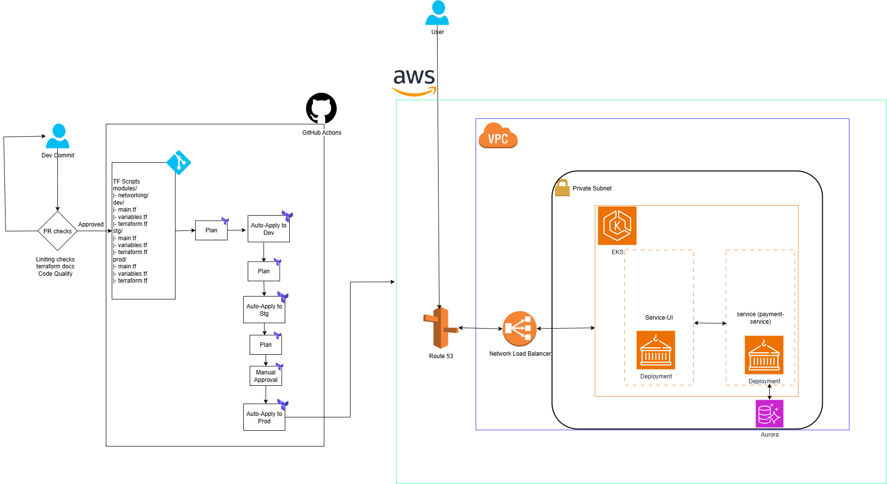
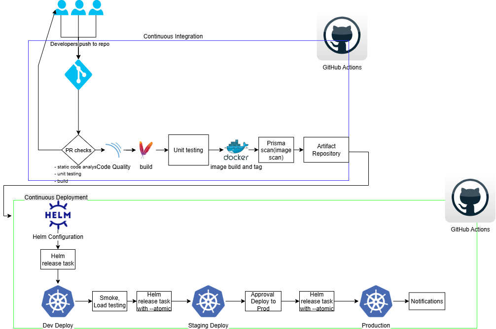
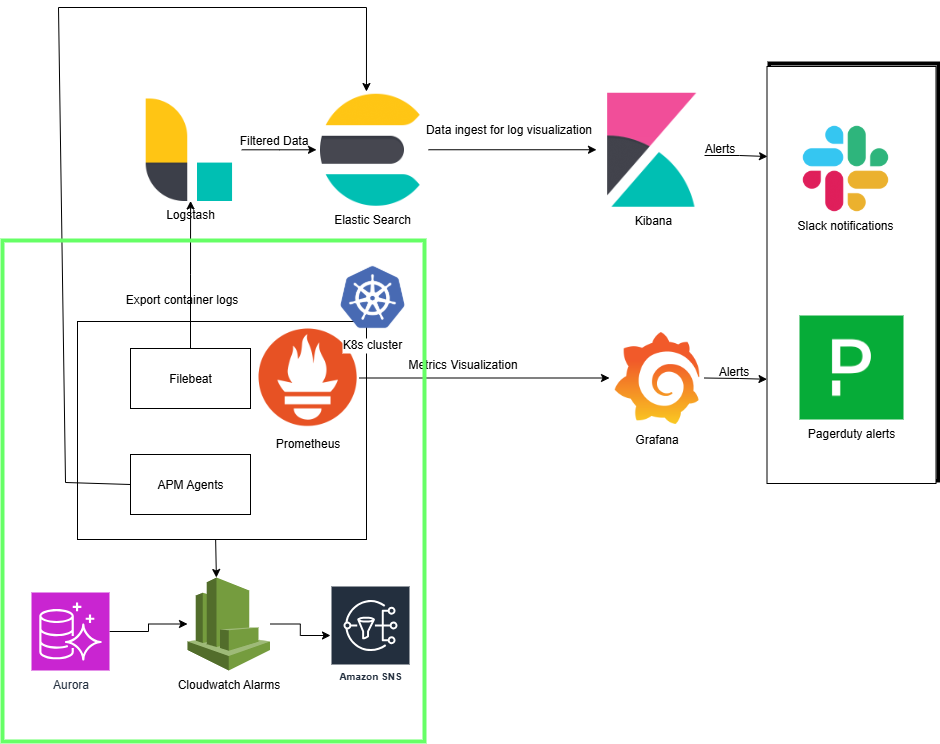

# Senior DevSecOps Lead Technical Assessment

This repository contains the complete implementation of the DevSecOps technical assessment, demonstrating enterprise-grade security practices, infrastructure automation, and CI/CD pipeline design for a microservices architecture.

## Assessment Overview

The assessment addresses two core areas:
- **Part 1**: Infrastructure Design & Architecture
- **Part 2**: DevSecOps Pipeline Implementation & Security Remediation

## Solution Architecture

### Microservices Stack
The solution implements three Spring Boot microservices representing a financial services ecosystem:
- **Account Service**: Customer account management
- **Payment Service**: Payment processing and validation
- **Transaction Service**: Transaction history and reporting

### Infrastructure Foundation
- **Cloud Platform**: AWS with multi-environment setup (development, production)
- **Container Orchestration**: Amazon EKS with auto-scaling capabilities
- **Service Mesh**: Istio for advanced traffic management and security
- **Storage**: Amazon RDS for persistent data with automated backups
- **Networking**: VPC with private subnets and NAT gateway configuration

### Security Implementation
- **Shift-Left Security**: Integrated SAST, dependency scanning, and container security
- **Runtime Protection**: Pod Security Standards and network policies
- **Secrets Management**: AWS Secrets Manager integration
- **Compliance**: Automated security reporting and audit trails

## Part 1: Infrastructure Design

### Architecture Diagrams


The infrastructure design implements:

**Network Security**: Private subnets with controlled egress through NAT gateways, security groups with least-privilege access, and VPC endpoints for AWS services.

**Compute Resources**: EKS node groups with mixed instance types for cost optimization, cluster autoscaler for dynamic scaling, and spot instances for non-critical workloads.

**Data Layer**: Multi-AZ RDS deployment with automated backups, read replicas for performance, and encryption at rest and in transit.

**Monitoring Stack**: Prometheus for metrics collection, Grafana for visualization, and CloudWatch for AWS service monitoring with automated alerting.

### Key Design Decisions
- **High Availability**: Multi-AZ deployment across three availability zones
- **Scalability**: Horizontal Pod Autoscaler and Cluster Autoscaler configuration
- **Security**: Defense-in-depth with multiple security layers
- **Cost Optimization**: Spot instances and resource right-sizing strategies

## Part 2: DevSecOps Pipeline

### CI/CD Architecture


The pipeline implements a security-first approach with three core stages:

**Security & Quality Scan**: SonarQube SAST analysis, OWASP dependency checking, and unit testing execution for pull requests.

**Build & Container Security**: Docker image building with multi-platform support, Trivy container vulnerability scanning, and secure registry storage.

**Deployment**: Helm-based Kubernetes deployment with health validation and automated rollback capabilities.

### Security Integration
- **Static Application Security Testing (SAST)**: SonarQube integration with quality gates
- **Dependency Scanning**: OWASP Dependency Check with CVSS scoring
- **Container Security**: Trivy scanning with SARIF reporting to GitHub Security
- **Infrastructure as Code**: Security policies enforced through admission controllers

### Pipeline Features
- **Commit-based Tagging**: Immutable image tags using git commit SHA
- **Environment Promotion**: Automated progression from development to production
- **Emergency Response**: Dedicated hotfix pipeline for critical security issues
- **Observability**: Comprehensive logging and Slack notifications

## Implementation Structure

```
├── docs/                          # Architecture and implementation documentation
├── implementation/ci-cd/          # Complete CI/CD pipeline implementation
│   ├── pipelines/                 # GitHub Actions workflows
│   ├── scripts/                   # Deployment and utility scripts
│   └── configs/                   # Security tool configurations
└── sample-services/               # Three microservices with security remediations
    ├── account-service/
    ├── payment-service/
    └── transaction-service/
```

## Security Remediation Results

### Identified Vulnerabilities
The initial security assessment identified critical vulnerabilities across all three microservices:
- Dependency vulnerabilities with CVSS scores above 7.0
- Insecure container configurations
- Missing security headers and input validation
- Inadequate logging and monitoring

### Remediation Actions
**Dependency Updates**: Upgraded all dependencies to latest secure versions, implemented dependency scanning in CI/CD pipeline, and established automated vulnerability monitoring.

**Container Hardening**: Implemented multi-stage Docker builds, non-root user execution, and minimal base images with regular security scanning.

**Application Security**: Added input validation, security headers, and proper error handling across all microservices.

**Infrastructure Security**: Deployed network policies, pod security standards, and secrets management integration.

## Deployment Guide

### Prerequisites
- AWS account with EKS permissions
- GitHub repository with Actions enabled
- Required secrets configured (AWS credentials, registry access)

### Quick Start
```bash
# Deploy infrastructure
terraform apply -var-file="environments/production.tfvars"

# Deploy applications
./implementation/ci-cd/scripts/deploy.sh production

# Verify deployment
./implementation/ci-cd/scripts/health-check.sh production
```

### Environment Configuration
Set the following secrets in GitHub repository settings:
- `AWS_ACCESS_KEY_ID`, `AWS_SECRET_ACCESS_KEY`, `AWS_REGION`
- `EKS_CLUSTER_NAME_DEVELOPMENT`, `EKS_CLUSTER_NAME_PRODUCTION`
- `SONAR_TOKEN`, `SLACK_WEBHOOK`

## Monitoring & Observability



The monitoring solution provides:
- **Application Metrics**: Custom business metrics and SLA monitoring
- **Infrastructure Metrics**: Cluster health and resource utilization
- **Security Metrics**: Vulnerability trends and compliance status
- **Alerting**: Multi-channel notifications for critical events

## Compliance & Standards

This implementation adheres to:
- **OWASP DevSecOps Guidelines** for secure development practices
- **NIST Cybersecurity Framework** for comprehensive security controls
- **CIS Kubernetes Benchmark** for container orchestration security
- **AWS Well-Architected Framework** for cloud infrastructure design

## Results Summary

The implementation successfully demonstrates:
- Enterprise-grade security integration throughout the development lifecycle
- Scalable infrastructure design supporting high-availability requirements
- Automated deployment pipeline with comprehensive security validation
- Complete remediation of identified security vulnerabilities
- Professional-grade monitoring and alerting capabilities

This solution provides a production-ready foundation for secure microservices deployment with automated security validation and comprehensive observability.
